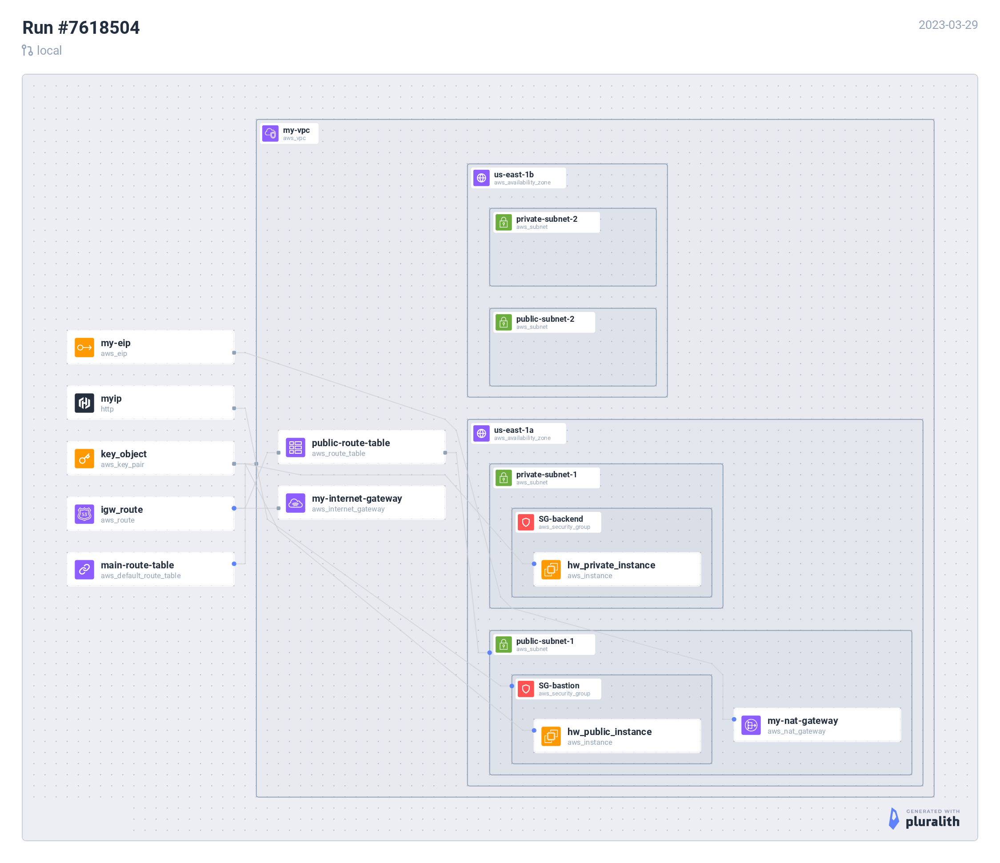

Module 4 Project
****************
In this project, you will create a VPC with two public
and private subnets. The private subnet will have Internet
access behind a NAT, and the instances within it won't be
publically addressable. As an additional challenge, you
are asked to create a private instance, and jump from a bastion
host in the public subnet to the private instance.

Diagram
-------
Here is a diagram of my terraform solution, to give
you an idea of how these resources are related.
Note that there is an implicit association between
the main route table and any subnets not associated
with the public route table.

Abbreviated instructions
------------------------
* Create a VPC

  * name: my-vpc, CIDR: 10.0.0.0/16

* Create Public and Private Subnets

  * name: public-subnet-1, AZ: us-east-1a, CIDR: 10.0.0.0/24
  * name: public-subnet-2, AZ: us-east-1b, CIDR: 10.0.1.0/24
  * name: private-subnet-1, AZ: us-east-1a, CIDR: 10.0.2.0/24
  * name: private-subnet-2, AZ: us-east-1b, 10.0.3.0/24

* Create and Internet Gateway (IGW)

  * name: my-internet-gateway, attached vpc: my-vpc

* Create a NAT Gateway

  * name: my-nat-gateway, subnet associations: public-subnet-1, EIP: allocate a new EIP.

* Configure the VPC's main route table to be private by default

  * find the vpcs main route table, rename-to: main-route-table
  * Add route with Destination: 0.0.0.0/0, Target: my-nat-gateway

* Create new route table for public subnets

  * name: public-route-table, Destination 0.0.0.0/0, Target: my-internet-gateway.

* Create a Bastion host on a public subnet

  * Network: Select the my-vpc, Subnet: public-subnet-1, Auto-assign Public IP: true,
    security group name: SG-bastion, security-group-ingress: ssh from my ip, keypair name:
    YellowTailKeyPair

* Bounus: Create an instance in the private subnet without a public ip, and use
  ssh agent forwarding to jump from the bastion host to the private instance.

  * name: backend-host, subnet: private-subnet-1, auth-assign public-ip: false,
    keypair: YellowTailKeyPair, security-group-name: SG-backend,
    security-group-ingress: ssh from my anywhere.
  * setup agent, add keys to agent, ``ssh -AJ ec2-user@$public_ip ec2-user@$private_ip``
