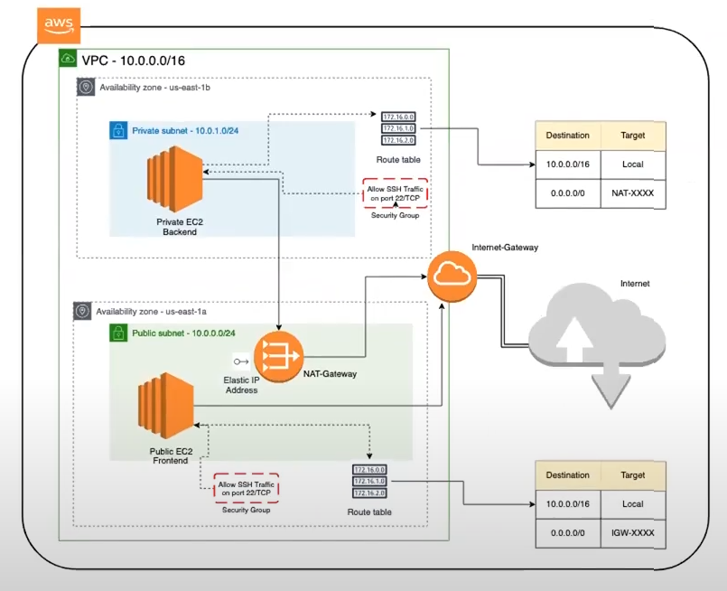
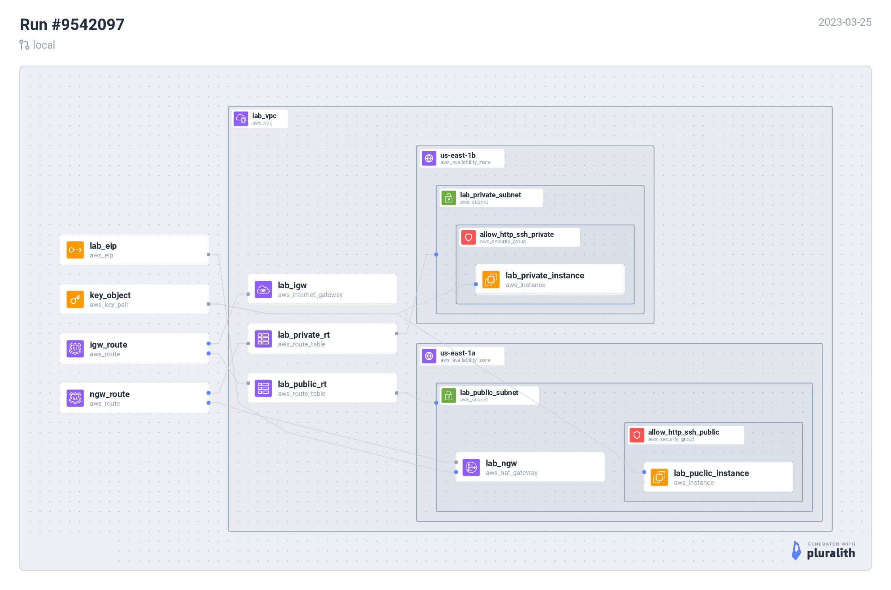

Readme
******

This is a lab to create a VPC with two subnets,
one private and one public. The private subnet
should have internet access behind a NAT. Inside
the public subnet there is a bastion host. In the
private subnet there is a target instance. The goal
is to reach the private instance from the bastion
instance.

To run this,

* Install aws-cli and add your API keys
* Change the path to the credentials file in the
  ``provider "aws"`` block within ``main.tf``.
* install terraform
* Run ``terraform apply``
* Run ``./test-ssh``

Here is a logical network topology diagram

...and here is a diagram generated from this projects
code (which sadly doesn't show the ip addresses)

